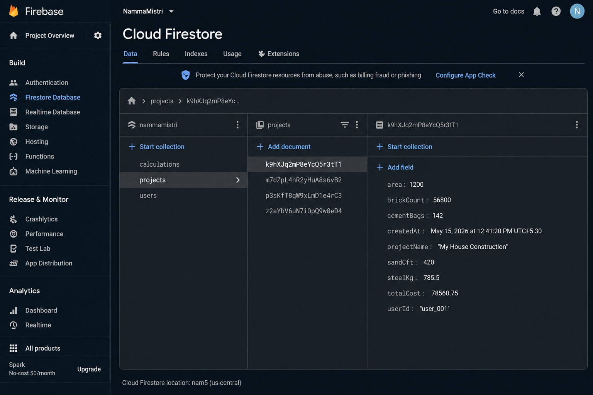

# NammaMistri 🏗️

NammaMistri is a smart construction management Android application designed to simplify material estimation, labor management, and site operations for contractors, engineers, and builders.

The application provides construction material calculations such as bricks, cement, sand, steel, and concrete volume using standard civil engineering formulas. The app is built with Kotlin, Android Studio, Firebase Firestore, and Material Design components.

---

# ✨ Features

## 🧱 Material Calculator

* Brick estimation
* Cement bag calculation
* Sand quantity calculation
* Steel estimation
* Concrete volume calculation
* 4.5 inch and 9 inch wall thickness support

## ☁️ Firebase Integration

* Firebase Firestore cloud database
* Real-time calculation storage
* Scalable cloud backend

## 🎨 Modern UI

* Dark theme interface
* Material Design components
* Bottom navigation layout
* Responsive UI

## 📱 Android Technologies Used

* Kotlin
* Android Studio
* Firebase Firestore
* ViewBinding
* Material Components
* Navigation Components

---

# 📂 Project Structure

```text
NammaMistri
 ┣ app
 ┃ ┣ java/com/nammamistri
 ┃ ┣ res
 ┃ ┣ google-services.json
 ┃ ┗ build.gradle.kts
 ┣ gradle
 ┣ build.gradle.kts
 ┗ settings.gradle.kts
```

---

# 🚀 Future Enhancements

* Worker attendance management
* Labor payment tracking
* AI-based cost estimation
* Site photo uploads
* Project expense tracking
* Contractor authentication system
* PDF report generation
* Cloud synchronization across devices

---

# ⚙️ Installation

1. Clone the repository

```bash
git clone https://github.com/yourusername/NammaMistri.git
```

2. Open project in Android Studio

3. Add your Firebase `google-services.json` file inside:

```text
app/google-services.json
```

4. Sync Gradle

5. Run the app on emulator or Android device

---

# 📸 Screenshots

## Home Screen


## Material Calculator


## Labour Management Screen


## Firebase Firestore Database



# 🛠️ Built With

* Kotlin
* Android Studio
* Firebase Firestore
* Material Design
* ViewBinding

---

# 👨‍💻 Developer

K Laxman Reddy

Computer Science Engineering (IoT & Cybersecurity)

---

# 📄 License

This project is developed for educational and portfolio purposes.
